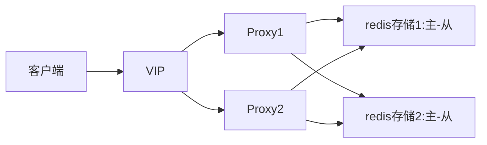

# redis-服务搭建

服务搭建分为两个部分：
- 如何对外提供访问入口
- 内部节点组织结构(单机、主从、哨兵、分片)

对比腾讯云、华为云、阿里云的产品，大概就能知道主流的部署方式
- [阿里云](https://help.aliyun.com/zh/redis/product-overview/overview-6?spm=a2c4g.11186623.0.0.9d0585b50TuaDW)
- [华为云](https://support.huaweicloud.com/productdesc-dcs/dcs-pd-191224001.html)
- [腾讯云](https://cloud.tencent.com/document/product/239/18336)

## proxy架构

客户端--->vip--->redis proxy ---> redis存储组(主从)
- vip层兼容所有redis client，提供负载均衡的能力
- proxy层
    - 根据key计算一致性hash，选择对应hash的存储组
    - 根据用户操作类型(读写)，来判断是主机还是备机
- 存储组主要就是通过主从架构提供存储服务的一堆redis实例

## cluster架构

